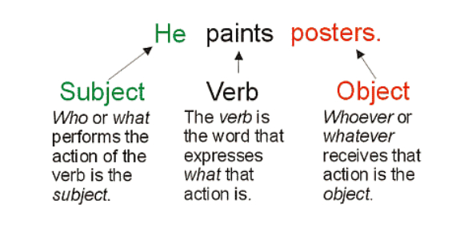
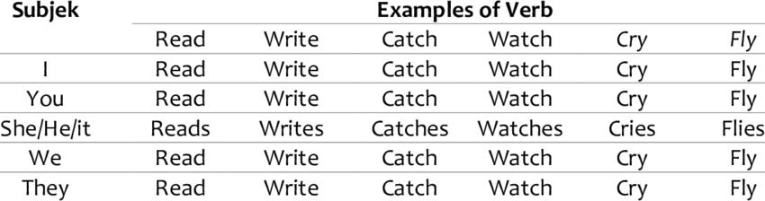
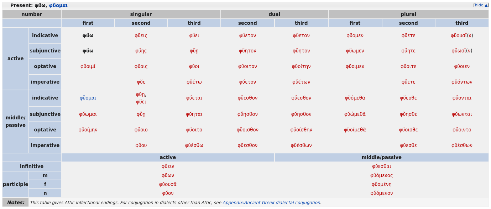

3decl: Part-of-Speech (POS) Tagging Classical Greek 
==============================
My process of building a functional Part-of-Speech Tagger for a rather complex language: Classical Greek.

## Part-of-speech tagging in English is pretty easy 

English has features that make it relatively easy to determine part-of-speech. 

Sentences follow Subject-Verb-Object:

Word endings are pretty simple:

## Greek is a hard language

But what if that wasn't true?

What if words could appear practically in any order, and part-of-speech was determined by an absurdly complex system of word endings?

With its nouns and adjectives (3 separate declensions of number, person, gender), verbs (2 types conjugated by person, number, aspect, mood, voice), participles (verbs declined like nouns), and particles (don't ask)...

Enter Classical Greek!

*Conjugation table for one tense of the verb φύω, to appear. φύω has 5 other tenses!*

## POS Classical Greek = NLP perfection

The subtle flexibility of the Greek language makes it perfect to study NLP with! 

To that end, here's how I built and evaluated a Part-of-Speech tagging system for Classical Greek.

# Steps
## Previous work shows 

## Treebanks 

## 

Project Organization
------------

    ├── LICENSE
    ├── Makefile           <- Makefile with commands like `make data` or `make train`
    ├── README.md          <- The top-level README for developers using this project.
    ├── data
    │   ├── external       <- Data from third party sources.
    │   ├── interim        <- Intermediate data that has been transformed.
    │   ├── processed      <- The final, canonical data sets for modeling.
    │   └── raw            <- The original, immutable data dump.
    │
    ├── docs               <- A default Sphinx project; see sphinx-doc.org for details
    │
    ├── models             <- Trained and serialized models, model predictions, or model summaries
    │
    ├── notebooks          <- Jupyter notebooks. Naming convention is a number (for ordering),
    │                         the creator's initials, and a short `-` delimited description, e.g.
    │                         `1.0-jqp-initial-data-exploration`.
    │
    ├── references         <- Data dictionaries, manuals, and all other explanatory materials.
    │
    ├── reports            <- Generated analysis as HTML, PDF, LaTeX, etc.
    │   └── figures        <- Generated graphics and figures to be used in reporting
    │
    ├── requirements.txt   <- The requirements file for reproducing the analysis environment, e.g.
    │                         generated with `pip freeze > requirements.txt`
    │
    ├── setup.py           <- makes project pip installable (pip install -e .) so src can be imported
    ├── src                <- Source code for use in this project.
    │   ├── __init__.py    <- Makes src a Python module
    │   │
    │   ├── data           <- Scripts to download or generate data
    │   │   └── make_dataset.py
    │   │
    │   ├── features       <- Scripts to turn raw data into features for modeling
    │   │   └── build_features.py
    │   │
    │   ├── models         <- Scripts to train models and then use trained models to make
    │   │   │                 predictions
    │   │   ├── predict_model.py
    │   │   └── train_model.py
    │   │
    │   └── visualization  <- Scripts to create exploratory and results oriented visualizations
    │       └── visualize.py
    │
    └── tox.ini            <- tox file with settings for running tox; see tox.readthedocs.io

--------

<small>Project based on the <a target="_blank" href="https://drivendata.github.io/cookiecutter-data-science/">cookiecutter data science project template</a>. #cookiecutterdatascience</small>

